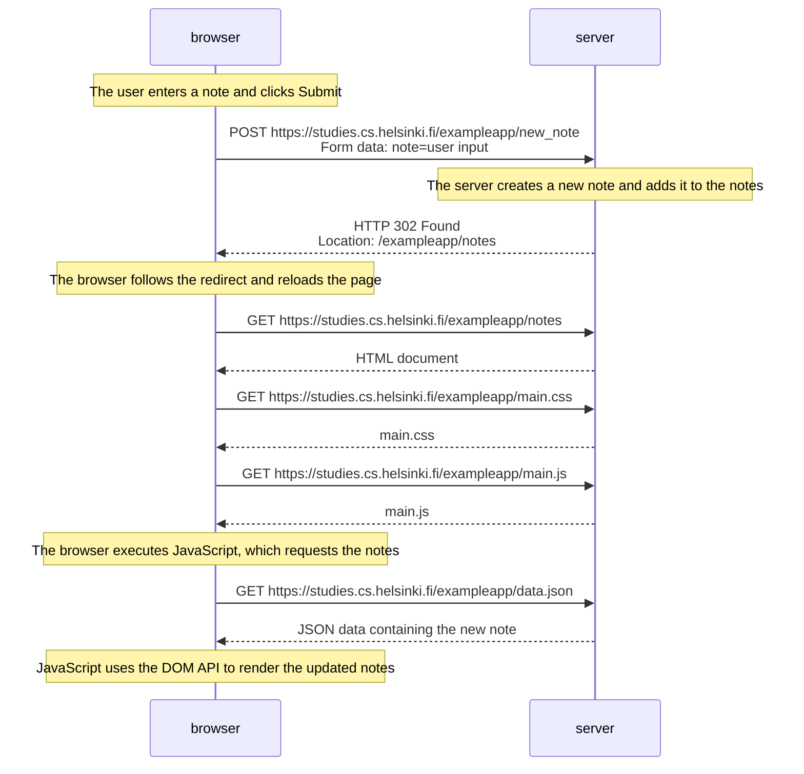

# 0.4: New note

```mermaid
sequenceDiagram
    participant browser
    participant server

    Note over browser: The user enters a note and clicks Submit
    browser->>server: POST https://studies.cs.helsinki.fi/exampleapp/new_note<br/>Form data: note=user input
    Note over server: The server creates a new note and adds it to the notes
    server-->>browser: HTTP 302 Found<br/>Location: /exampleapp/notes

    Note over browser: The browser follows the redirect and reloads the page
    browser->>server: GET https://studies.cs.helsinki.fi/exampleapp/notes
    server-->>browser: HTML document
    browser->>server: GET https://studies.cs.helsinki.fi/exampleapp/main.css
    server-->>browser: main.css
    browser->>server: GET https://studies.cs.helsinki.fi/exampleapp/main.js
    server-->>browser: main.js

    Note over browser: The browser executes JavaScript, which requests the notes
    browser->>server: GET https://studies.cs.helsinki.fi/exampleapp/data.json
    server-->>browser: JSON data containing the new note
    Note over browser: JavaScript uses the DOM API to render the updated notes
```
