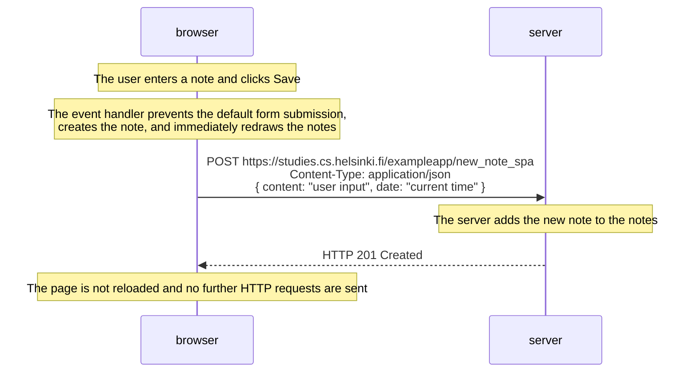

# 0.6: New note in the single-page app

```mermaid
sequenceDiagram
    participant browser
    participant server

    Note over browser: The user enters a note and clicks Save
    Note over browser: The event handler prevents the default form submission,<br/>creates the note, and immediately redraws the notes
    browser->>server: POST https://studies.cs.helsinki.fi/exampleapp/new_note_spa<br/>Content-Type: application/json<br/>{ content: "user input", date: "current time" }
    Note over server: The server adds the new note to the notes
    server-->>browser: HTTP 201 Created
    Note over browser: The page is not reloaded and no further HTTP requests are sent
```
